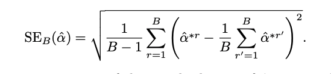

```{r setup, include=FALSE, warning=FALSE}
knitr::opts_chunk$set(echo = TRUE)
library(tidyverse)
library(tidymodels)
library(corrplot)
library(ggthemes)
library(discrim)
library(leaps)
```

In this assignment, I will be using
[Tidymodels](https://www.tidymodels.org/) instead of base R.

# Exercise 1 (10 points)

Review of *k*-fold cross-validation.

a.  Explain how *k*-fold cross-validation is implemented.

This method involves randomly splitting the set of observations into k groups, or folds, of roughly similar size using a k-fold CV. The first fold serves as a validation set, and the method is fitted to the remaining $k$-1 folds. On the observations in the held-out fold, the mean squared error, $MSE_1$, is calculated. This technique is done k times, with each validation set consisting of a different set of observations. This approach yields $k$ test error estimates, $MSE_1$, $MSE_2$,..., $MSE_k$. By averaging these values, the $k$-fold CV estimate is created.

b.  What are the advantages and disadvantages of *k*-fold cross-validation relative to
    - The validation set approach
    - LOOCV

## k-Fold CV vs Validation set

### Advantages 
  - k-fold CV has much lower variability than the validation set approach, especially in small datasets.
  - All the observations can be used to both training and testing model performance.
  - When compared to a model fit on the entire data set, the validation set approach can overestimate the test error because most models improve with more data, and a major fraction is ignored entirely from training.

### Disadvantages 
  - When compared to k-fold CV, the validation set is much easier to carry out.
  - The validation set approach saves time because a model is only trained and evaluated once, meaning that  k-fold CV can be far more time consuming for large data and for large values of k.

## k-Fold CV vs Leave-One-Out Cross-Validation

### Advantages
  - Compared to LOOCV, k-Fold CV requires less computational power when running data set. For example, when k = 10, n = 1000, k-Fold CV will just fit 10 models, but LOOCV will fit 1000 times (LOOCV is computationally intensive because we need a lot of computational power even for modest data sets).
  - Due to the bias-variance trade-off, there is some evidence that k-fold CV can provide a more accurate estimate of the test error rate than LOOCV (LOOCV has lower bias but higher variance).

### Disadvantages
  - Repeating LOOCV will always produce the same results: there is no randomness in the training/validation set splits. That is, LOOCV produces a less variable MSE.
  - The estimation of LOOCV has low bias, which is close to the true value.

# Exercise 2 (10 points)

Denote whether the following statements are true or false. Explain your reasoning.

a.  When $k = n$ the cross-validation estimator is approximately unbiased for the true prediction error.
- Ans: True

b.  When $k = n$ the cross-validation estimator will always have a low variance.
- Ans: False

When $k = n$,the cross-validation estimator is almost unbiased for the expected prediction error. However, it can have high variance because the N "training sets" are all so similar. The computational load is also sizable, requiring N applications of the learning method.

c.  Statistical transformations on the predictors, such as scaling and centering, must be done inside each fold.
- Ans: False

All the column-wise data transformation can be carried out inside each fold. However, data transformation within a cross-validation loop can significantly slow down the entire process. The better method would be to perform as much data pre-processing as possible prior to cross-validation.

# Exercise 3 (20 points)

This exercise should be answered using the `Weekly` data set, which is part of the `LSLR` package. If you don't have it installed already you can install it with

```{r}
# install.packages("ISLR")
```

To load the data set run the following code

```{r}
library(ISLR)
data("Weekly")
# see the variables' name
names(Weekly)
```

a.  Create a test and training set using `initial_split()`. Split proportion is up to you. Remember to set a seed!
```{r}
# set a seed
set.seed(1)
# the proportion we use 80 % for training set, and 20 % for testing set
weekly_split <- initial_split(Weekly, prop = 0.8, strata = Direction)
weekly_split

# training and testing sets
weekly_train <- training(weekly_split)
weekly_test <- testing(weekly_split)
```

b.  Create a logistic regression specification using `logistic_reg()`. Set the engine to `glm`.
```{r}
# set a logistic regression specification
lr_spec <- logistic_reg() %>%
  set_engine("glm") %>%
  set_mode("classification")
lr_spec 
```

c.  Create a 5-fold cross-validation object using the training data, and fit the resampled folds with `fit_resamples()` and `Direction` as the response and the five lag variables plus `Volume` as predictors. Remember to set a seed before creating k-fold object.
- In `fit_resamples`, `.predictions` is present when `save_pred = TRUE`. This list column contains tibbles with the out-of-sample predictions.
```{r}
# create a workflow object
lr_wf <- workflow() %>%
  add_model(lr_spec) %>%
  add_formula(Direction ~ Lag1 + Lag2 + Lag3 + Lag4 + Lag5 + Volume)

weekly_cv5 <- vfold_cv(data = weekly_train, v = 5, strata = Direction)

# fit the model within each of the folds
# 
fit_weekly_cv5 <- fit_resamples(lr_wf, resamples = weekly_cv5,
                                control = control_resamples(save_pred = TRUE))
fit_weekly_cv5$.metrics
```

d.  Collect the performance metrics using `collect_metrics()`.Interpret.
- Each fold's training process estimation is close to 0.55.
```{r}
fit_weekly_cv5 %>%
  collect_metrics(summarize = FALSE) %>%
  filter(.metric == "accuracy" )
```

e.  Fit the model on the whole training data set. Calculate the accuracy on the test set. How does this result compare to results in d. Interpret.

On testing data, the predicted accuracy is 54%, which is close to the results of 5 training folders.
```{r}
final_fit_weekly_cv5 <- fit(lr_wf, data = weekly_train)

augment(final_fit_weekly_cv5, new_data = weekly_test) %>%
  accuracy(truth = Direction, estimate = .pred_class)
```

# Exercise 4 (15 points)

We will now derive the probability that a given observation is part of a bootstrap sample. Suppose that we obtain a bootstrap sample from a set of $n$ observations.

Bootstrapping is a statistical process for generating multiple simulated samples from a single dataset. For a variety of sample statistics, this procedure allows we to calculate standard errors, generate confidence intervals, and do hypothesis testing.

a.  What is the probability that the first bootstrap observation is *not* the $j$th observation from the original sample? Justify your answer.

There are n observations can be extracted in data set. Because any of the n observations has an equal chance of being chosen, the probability that the $j$th observation is chosen as the first bootstrap observation is $\frac{1}{n}$. As a result, the probability that the first bootstrap observation is *not* the $j$th observation from the original sample is $1 - \frac{1}{n}$.

b.  What is the probability that the second bootstrap observation is *not* the $j$th observation from the original sample? Justify your answer.

Because bootstrap resamples the rows with replacement. As part a mentioned, each observation has an equal chance of being chosen so the probability will still be $1 - \frac{1}{n}$.

c.  Argue that the probability that the $j$th observation is *not* in the bootstrap sample is $(1-1/n)^n$.

The selection probabilities are independent because we use sampling with replacement to generate the bootstrap sample. In this case, $j$th observation is not the first bootstrap observation, $j$th observation is not the second bootstrap observation.......$j$th observation is not the $n$ bootstrap observation. Based on the previous formula, we can calculate the probability is ($1 - \frac{1}{n}$) * ($1 - \frac{1}{n}$).......etc.. With $n$th observation, the probability will be $(1-1/n)^n$. 

d.  When $n = 5$ what is the probability that the $j$th observation is in the bootstrap sample?

The probability that the $j$th observation is *not* in the bootstrap sample is $(1-1/n)^n$ so we can derive the probability that the $j$th observation in the bootstrap sample is:

Ans: 0.67232
$$
1-(1 - \frac{1}{n})^n
$$

```{r}
# crate the probability function
probBootstrap <- function(n){
 ans <- 1-(1-1/n)^n 
 return(ans)
}
probBootstrap(5)
```

e.  When $n = 100$ what is the probability that the $j$th observation is in the bootstrap sample?

Ans: 0.6339677
```{r}
probBootstrap(100)
```

f.  When $n = 10,000$ what is the probability that the $j$th observation is in the bootstrap sample?

Ans: 0.632139
```{r}
probBootstrap(10000)
```

g.  Create a plot that displays, for each integer value of $n$ from 1 to 100,000 the probability that the $j$th observation is in the bootstrap sample. Comment on what you observe.

On average, the probability of j = 100, 10000 is close to 0.632 from the previous questions. For each bootstrap sample, approximately 0.632 of the elements will be used (some more than once), that's what the 0.632 Bootstrap Method is. The red horizontal line represents 0.632 probability, which approximately corresponds to the probability of $j$th observation. 
```{r}
tibble(x = 1:10000, y = probBootstrap(x)) %>%
ggplot(aes(x = x, y = y)) +
  geom_point() +
  labs(x = "jth Observation", y = "Probability of j", 
  title = " Probability of j Observation in Bootstrap Sample") +
  geom_hline(aes(yintercept = 1 - 1/exp(1), col = "0.632")) +
  theme_bw() 
```

h.  We will now investigate numerically that a bootstrap sample of size $n = 100$ contains the $j$th observation. Here $j = 4$. We repeatedly create bootstrap samples, and each time we record whether or not the fourth observation is contained in the bootstrap sample.

```{r}
set.seed(69) # set a seed here
store <- integer(10000)
for (i in seq_along(store)) {
  store[i] <- sum(sample(seq_len(100), replace = TRUE) == 4) > 0
}
mean(store)
```

Comment on the results obtained.

The simulation indicates that this appears to be correct, with 63.2 percent containing 4th observation, on average. Even with large datasets, there is always approximate a 63 % chance that any particular thing will be in the bootstrap sample.


# Exercise 5 (10 points)

Suppose that we use some statistical learning method to make a prediction for the response $Y$ for a particular value of the predictor $X$.

a.  Carefully describe how we might estimate the standard deviation of our prediction.

The Bootstrap method is suitable for estimating the standard deviation of our prediction. Rather than acquiring new independent data sets from the population and fitting our model to them, we acquire repeated random samples from the original data set. To be precise, we sample with replacement $n$ times and then use the following equation to determine the associated estimates and standard deviation of those $n$. 



b.  Is this procedure depends on what statistical learning method we are using?

This is a supervised learning. Regression and classification are two types of supervised machine learning techniques, while clustering and association are two types of unsupervised learning. The supervised learning indicates that **some data has already been tagged with the correct answer**, as demonstrated by the previous questions and examples.

# Exercise 6 (15 points)

This exercise should be answered using the `Default` data set, which is part of the `LSLR` package. If you don't have it installed already you can install it with
```{r}
#install.packages("ISLR")
```

To load the data set run the following code
```{r}
library(ISLR)
data("Default")
head(Default)
```

a.  Use the `parsnip` package to fit a logistic regression on the `default` data set. `default` is the response and `income` and `balance` are the predictors. Then use `summary()` on the fitted model to determine the estimated standard errors for the coefficients associated with `income` and `balance`. Comment on the estimated standard errors.

In the real data, we can see the p-value of intercept, $b_1$, and $b_2$ are totally in the significant level. The smaller the standard error, the more precise the estimate. The standard error indicates how close any `income` and `balance` of that population's mean is likely to be to the true population mean. The estimated standard error of `income` is 0.000004985, and the estimated standard error of `balance` is 0.4348.
```{r}
lr_spec %>%
  fit(default ~ income + balance, data = Default) -> lr_fit
lr_fit

lr_fit %>%
  pluck("fit") -> lr_fit_fit
summary(lr_fit_fit)
```

b.  Use the `bootstraps()` function from the `rsample` package to generate 25 bootstraps of `Default`.
```{r}
default_boots <- bootstraps(Default, strata = default, time = 25) 
default_boots 
```

c.  Run the following code. Change `boots` to the name of the bootstrapping object created in the previous question. This will take a minute or two to run. Comment on

-  Changed `boots` to `default_boots`.
```{r}
# This function takes a `bootstrapped` split object, and fits a logistic model
fit_lr_on_bootstrap <- function(split) {
    logistic_reg() %>%
    set_engine("glm") %>%
    set_mode("classification") %>%
    fit(default ~ income + balance, analysis(split))
}
# This code uses `map()` to run the model inside each split. Then it used
# `tidy()` to extract the model estimates the parameter
boot_models <-
  default_boots %>% # changed name
  mutate(model = map(splits, fit_lr_on_bootstrap),
         coef_info = map(model, tidy))
# This code extract the estimates for each model that was fit
boot_coefs <-
  boot_models %>% 
  unnest(coef_info)
# This code calculates the standard deviation of the estimate
sd_estimates <- boot_coefs %>%
  group_by(term) %>%
  summarise(std.error_est = sd(estimate))
sd_estimates
```

a.  Comment on the estimated standard errors obtained using the `summary()` function on the first model and the estimated standard errors you found using the above code.

In the Bootstrap method, we take random samples from the population, and we would expect $\hat{balance}$ to differ from `balance` by approximately 0.00017, and except $\hat{income}$ to differ from `income` by approximately 0.0000005, on average. Look at the `diff` column, which indicates the different values between first model and the estimated standard errors that we bootstrapped split object. The small different values means the Bootstrap resampling method is close to the ground truth.
```{r}
summary(lr_fit_fit)$coefficients %>%
  as_tibble() %>%
  rename(std.error_real = "Std. Error") %>%
  select(std.error_real) -> tmp
bind_cols(sd_estimates, tmp) %>%
  mutate(diff = abs(std.error_est - std.error_real))
```

# References
- https://www.tmwr.org/resampling.html
- https://stats.stackexchange.com/questions/90902/why-is-leave-one-out-cross-validation-loocv-variance-about-the-mean-estimate-f
- Hastie, T., Tibshirani, R., & Friedman, J. (2009). *The elements of statistical learning: data mining, inference, and prediction*. Springer Science & Business Media.
- https://medium.com/machine-learning-eli5/cross-validation-the-right-way-386839ed39b1

