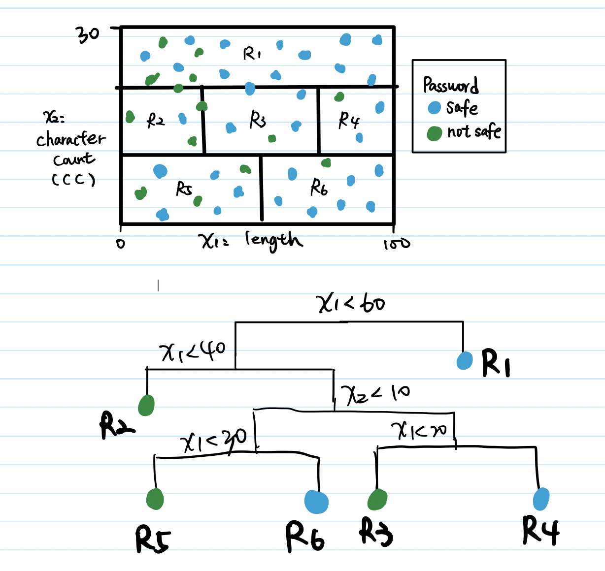

```{r setup, include=FALSE, warning=FALSE}
knitr::opts_chunk$set(echo = TRUE)
library(tidyverse)
library(tidymodels)
library(ggthemes)
```

In this assignment, I will be using [Tidymodels](https://www.tidymodels.org/) framework instead of base R.

# Exercise 1 (10 points)

Suppose we fit a curve with basis functions $b_1(X) = X$, $B_2(X) = (X - 1)^2 I(X \geq 1)$. Note that $I(X \geq 1)$ equals 1 for $X \geq 1$ and 0 otherwise. We fit the linear regression model

$$Y = \beta_0 + \beta_1b_1(X) + \beta_2b_2(X) + \varepsilon$$

and obtain the coefficient estimates $\hat \beta_0 = 1$, $\hat \beta_1 = 1$, $\hat \beta_2 = -2$. Sketch the estimated curve between $X = -2$ and $X = 2$. Note the intercepts, slopes and other relevant information.
 
- If $X < 1$, the estimated curve is $\hat{f} (X) = 1+ X$ . The intercept and slope are both 1.
- If $X >= 1$, the estimated curve: $\hat{f} (X) = 1 + X-2(X - 1)^2$.
```{r}
X <- seq(-2, 2, 0.01)
Y <-  1 + X + -2 * (X - 1)^2 * (X >= 1)
df1 <- tibble(X, Y)

ggplot(df1, aes(X, Y)) + 
  geom_vline(xintercept = 0) + 
  geom_hline(yintercept = 0) + 
  geom_vline(xintercept = 1, col = "red") + 
  geom_line(size = 3, color = "green") +
  theme_bw()
```

# Exercise 2 (10 points)

Suppose we fit a curve with basis functions
$b_1(X) = I(0 \leq X \leq 2) - (X-1)I(1 \leq X \leq 2)$, 
$B_2(X) = (X - 3) I(3 \leq X \leq 4) + I(4 < X \leq 5)$. We fit the linear regression model

$$Y = \beta_0 + \beta_1b_1(X) + \beta_2b_2(X) + \varepsilon$$
and obtain the coefficient estimates $\hat \beta_0 = 1$, $\hat \beta_1 = 1$, $\hat \beta_2 = 3$. Sketch the estimated curve between $X = -2$ and $X = 2$. Note the intercepts, slopes and other relevant information.

-  If $X < 0$, the $\hat{f}(X) = 1$. When $X < 0$, we can see the horizontal line, indicating that the slope is zero.
- If $0 <= X < 1$, the $\hat{f}(X) = 1 + 1 = 2 $. The horizontal line between 0 to 1 still indicating that the slope is zero.
- If $0 <= X < 1$, the $\hat{f}(X) = 1 + 1 - (X - 1) * 1 = - X +3 $. Now, the slope is -1.
```{r}
X <- seq(-2, 2, 0.01)
Y <- 1 + (X >= 0 & X <= 2) - (X - 1)*(X >= 1 & X <= 2) + 
     3*(X - 3)*(X >= 3 & X <= 4) + 3*(X > 4 & X <= 5)

df2 <- tibble(X, Y)

ggplot(df2, aes(X, Y)) + 
  geom_vline(xintercept = 0) + 
  geom_hline(yintercept = 0) + 
  geom_line(size = 3, color = "blue") +
  theme_bw()
```

# Exercise 3 (10 points)

Explain what happens to the bias/variance trade-off of our model estimates use regression splines.

Regression splines is a more flexible method because instead of fitting 1 polynomial over the whole range of data, it fits a combination of linear/polynomial functions in a piecewise manner. In general, as we use more flexible methods, the variance will increase because changing datasets will be more likely to produce a different set of model estimates. The bias will decrease because the error is smaller when the model fits the data better. Therefore, compared to linear regression, when we use regression splines, variance will increase and bias will decrease. However, bear in mind that, at some point increasing flexibility has little impact on the bias but starts to significantly increase the variance. 


# Exercise 4 (10 points)

Draw an example (of your own invention) of a partition of two-dimensional feature space that could result from recursive binary splitting. Your example should contain at least six regions. Draw a decision tree corresponding to this partition. Be sure to label all aspects of your figures, including regions $R_1, R_2, ...$, the cut points $t_1, t_2, ...$, and so forth.



# Exercise 5 (10 points)

Provide a detailed explanation of the algorithm that is used to fit a regression tree.

Decision trees are constructed via an algorithmic approach that identifies ways to split a data set based on different conditions. When the target values take discrete values (such as dummy variables), we call them classification trees and when the target values take continuous values, we call them regression trees. It consists of a series of splitting rules, starting at the top of the tree. The algorithm begins with the top split where it assigns observations into two branches (recursive binary splitting). The algorithm selects the split that minimizes the sum of the squared deviations from the mean in the two separate partitions. This splitting rule is then applied to each of the new branches. This process continues until each node reaches a user-specified minimum node size and becomes a terminal node.

# Exercise 6 (10 points)

Explain the difference between bagging, boosting, and random forests.

**Bagging** entails utilizing the bootstrap to make numerous copies of the original training data set, fitting a different decision tree to each copy, and then integrating all of the trees to make a single predictive model. Each tree is created *independently* of the others using a bootstrap data set.

**Boosting** operates in a similar way, but the trees are grown in a *sequential* order, with each tree receiving information from preceding trees. Instead of using bootstrap sampling, boosting uses a modified version of the original data set to fit each tree. Random Forest split in a tree is considered, a random sample of m predictors is chosen as split candidates from the full set of p predictors.

**Random forests** outperform bagged trees due to a chance small tweak that decorrelates the trees. When considering a Random Forest split in a tree, a random sample of m predictors from the full set of p predictors is chosen as split candidates.

In summary, bagging focuses on reducing the variance of a decision tree, whereas random Forest is an extension of bagging that uses a random selection of features rather than all features to grow trees. Boosting will attempt to produce strong models that are less biased than their elements (even if variance can also be reduced).

# Exercise 7 (20 points)

You will be using the Boston data found [here](data/Boston.csv). The response is `medv` and the remaining variables are predictors.

## Read the Data

The range of `medv` is between 5 to 50.
```{r}
Boston <- read_csv("./data/Boston.csv")
str(Boston)
summary(Boston)
```

Do test-training split as usual, and fit a random forest model or boosted tree (your choice) and a linear regression model.

## Split the Data
```{r}
Boston_split <- initial_split(Boston)
set.seed(1234)
Boston_train <- training(Boston_split)
Boston_test <- testing(Boston_split)
```

The random forest or boosted tree model has a selection of hyper-parameters that you can tune to improve performance. Perform hyperparameter tuning using k-fold cross-validation to find a model with good predictive power. How does this model compare to the linear regression model?

## Random Forest Model

We want to find the optimal minimum number of data points in a node, so we use `tune()` to find it.
```{r}
rand_forest_randomForest_spec <-
  rand_forest(min_n = tune()) %>% # mtry = tune(), min_n = tune()
  set_engine('randomForest') %>%
  set_mode('regression')
```

## Recipe and Workflow
```{r}
rec_Boston <- recipe(medv ~ ., data = Boston_train)
rf_wf <- workflow() %>%
  add_recipe(rec_Boston) %>%
  add_model(rand_forest_randomForest_spec)
```

Set the minimum node size to anywhere between 2 and 40 to find the best value using the algorithm.
```{r}
param_grid <- grid_regular(min_n(), levels = 30)
param_grid
```

## k-fold cross-validation

Create the Cross-Validation term in order to use in the following `tune_grid()` session later, the number of default folds is 10.
```{r}
set.seed(4321)
cv <- vfold_cv(Boston, strata = medv, v = 10)
```

## Tune
```{r, message=FALSE}
tune_res <- tune_grid(
  object = rf_wf,
  resamples = cv,
  grid = param_grid, 
  control = control_grid(verbose = TRUE)
)
autoplot(tune_res)
```
## Fit the Model

The best minimal node size in this model is 2 so we use 2 to fit the model.
```{r}
best <- select_best(tune_res, metric = "rmse")
best
rf_final <- finalize_workflow(rf_wf, best)

rf_fit <- fit(rf_final, data = Boston_train)
rf_fit
```

## Random Forest Evaluation

We can see from the small rmse that the fitted model is good. Furthermore, the plot shows that the vast majority of predicted `medv` values are very close to the observed values.
```{r}
augment(rf_fit, new_data = Boston_test) %>%
  rmse(truth = medv, estimate = .pred) %>%
  mutate(description = "random forest model") -> rf_model
rf_model
```

```{r}
augment(rf_fit, new_data = Boston_test) %>%
  ggplot(aes(medv, .pred)) +
  geom_abline() +
  geom_point(alpha = 0.5)
```

## Linear Regression Model

```{r}
lm_spec <- linear_reg() %>%
  set_mode("regression") %>%
  set_engine("lm")
```

## Fit the Model
```{r}
lm_fit <- lm_spec %>%
  fit(medv ~., data = Boston_train)

lm_fit$fit %>%
  summary()
```

# Linear Regression Model Evaluation

The linear regression model's output is also not bad.
```{r}
augment(lm_fit, new_data = Boston_test) %>%
  rmse(truth = medv, estimate = .pred) %>%
  mutate(description = "linear regression model") -> lm_model
lm_model
```

```{r}
augment(lm_fit, new_data = Boston_test) %>%
  ggplot(aes(medv, .pred)) +
  geom_abline() +
  geom_point(alpha = 0.5)
```

## Comparison

Finally, because the random forest model has a smaller root mean squared error, the `rf_model` outperforms the linear regression model.
```{r}
bind_rows(rf_model, lm_model)
```

# References
- https://towardsdatascience.com/decision-tree-ensembles-bagging-and-boosting-266a8ba60fd9
- https://towardsdatascience.com/ensemble-methods-bagging-boosting-and-stacking-c9214a10a205

